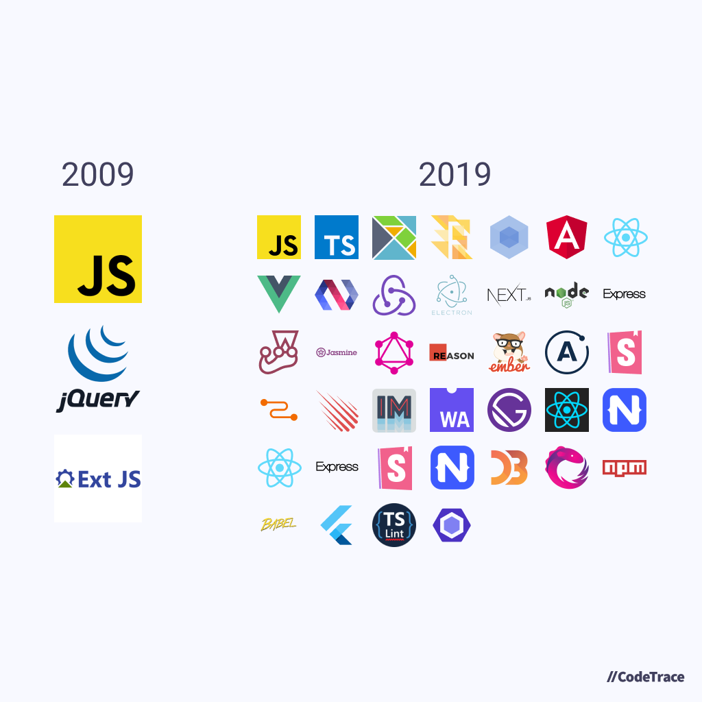

# 前后端分离考

## 前后端分离的故事

---

# 前后端分离考

## 前后端分离的故事

Web开发的发展史是一部“前后端分离”史

“兼容性”和“模块化”是其沿革的两条脉络

前后端分离的本质是前后端关注点分离

---

# 十年

## 十年前？现在？

---



---

# 2009

- ES5发布（2009.12）
- IE6、7、8
- 锋利的jQuery、ExtJS
- Flash
- AngularJS诞生
- SPA、AJAX流行

---

# 2019

- HTML5
- ES6+
- webpack
- Angular、React、Vue
- Node.js
- Server Side Render

---

# 再往前的历史

- 静态页面（80年代～90年代）
- CGI（90年代）
- Perl、PHP
- ASP、J2EE
- 服务端Template
- SPA、AJAX开始流行
- 前端MVC思想诞生（2010年左右）
- MVVM，三大框架（2013年）
- PWA、Web前端走向多端
- 越发丰富的前端工具链与新标准

---

# 死掉的技术

## RIP

- Java applets
- ActiveX、Microsoft Silverlight
- FLash、Flex
- XHTML、XML

以上技术皆死于兼容性

---

# jQuery已死，jQuery万岁！

---

# Why?

---

# Why?

## 兼容性：从追逐标准到超越标准

- 加兼容的中间层（Polyfill）
- 转译工具

## 模块化：不要重复造轮子

- AMD、CommonJS、ESM
- BEM、CSS Modules
- React

---

# 控制复杂度，关注点分离

### 后端

- 服务端的数据与业务
- 以网关为界对外提供能力
- 可信任、
- 接口性能、解耦、安全

### 前端

- 展示与交互
- 大前端：Web应用、移动应用、桌面应用
- 关注体验
- 不可信任
- 页面性能、交互、动画

---

# 前后端分离的本质是前后端关注点分离

## 应运而生的相关技术

---

# 单页应用（SPA）诞生

```html
<!DOCTYPE html>
<html lang="zh">

<head>
    <meta charset="UTF-8">
    <title>SPA</title>
</head>

<body>
<div id="app"></div>
<script type="text/javascript" src="main.js">
</script>
</body>

</html>
```

---

# 早期单页应用

- AMD：RequireJS
- 前端MVC框架：Backbone.js
- 异步请求：jQuery
- DOM：jQuery

## 特点

- 直接操作DOM
- 没有预处理（为了兼容性，只能使用较老的特性）
- 模块化较为简陋
- 使用`location.hash`

--- 

# 前端路由

## Hash路由

- 兼容性好
- 不需要后端作相关配置
- 滥用了浏览器Location的Hash特性

## History路由

- 美观、符合直觉
- 不支持IE10以前的浏览器
- 需要后端作相关配置

---

# 前端路由

## History路由

```nginx
location / {
    root   /path/to/static/;
    index  index.html;
    try_files $uri $uri/ /index.html;
}
```

---

# 如今的单页应用

- webpack
- TypeScript、Babel
- CSS预处理器、CSS Modules
- Angular、React、Vue
- Next.js

---

# 兼容性、模块化的实践

- 前后端实际是两个模块
- jQuery：构建一个中间层代理浏览器的API
- webpack+loader：预处理编译器
- AMD、CommonJS、ESM：模块标准
- React：发明DSL，抽象出组件的概念

---

# 几个实践分享

- 最简单的单页应用的示例
- 使用Web Jar发布前后端分离的应用
- 使用Docker发布静态资源容器（Nginx）
- 使用Node.js发布静态资源

---

# 最简单的单页应用的示例

```html
<!DOCTYPE html>
<html lang="zh">
<head>
    <meta charset="UTF-8">
    <title>SPA</title>
</head>
<body>
<div id="route">
    <ul>
        <a href="">
            <li>首页</li>
        </a>
        <a href="#/article">
            <li>文章</li>
        </a>
        <a href="#/about">
            <li>关于</li>
        </a>
        <ul>
</div>
<div id="app"></div>
</body>
<script>
    // javascript
</script>
</html>
```

---

```javascript
const el = document.getElementById('app')

function navigate() {
    const path = location.hash.substring(2)
    const title = path
    switch (path) {
        case '':
            el.innerHTML = '<h1>首页</h1><p>欢迎首页</p>'
            break
        case 'article':
            el.innerHTML = '<h1>文章</h1><p>某篇文章</p>'
            break
        case 'about':
            el.innerHTML = '<h1>关于</h1><p>关于页面</p>'
            break
        default:
            el.innerHTML = '<h1>404页面</h1>'
    }
}

window.addEventListener('popstate', navigate)
window.addEventListener('DOMContentLoaded', navigate)
```

---

# 最简单的单页应用的示例

---

# 使用Web Jar发布前后端分离的应用

---

# 使用Docker发布静态资源容器（Nginx）

---

# 使用Node.js发布静态资源

## serve工具

```sh
npx serve
```

---

# Q&A