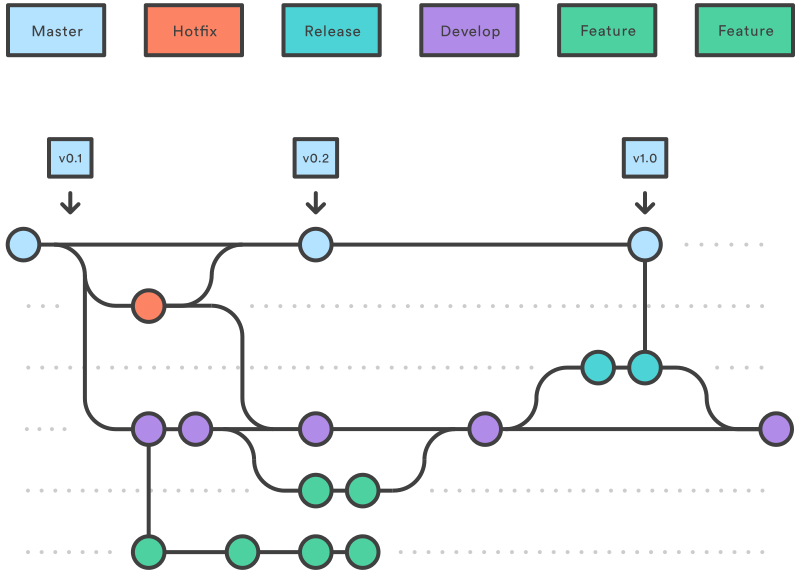

# Git常见工作流介绍

---

# Git简介与基本使用

## Git是一个分布式版本控制系统（DVCS）

- 速度
- 简单的设计
- 对非线性开发模式的强力支持（允许成千上万个并行开发的分支）
- 完全分布式
- 有能力高效管理类似 Linux 内核一样的超大规模项目（速度和数据量）

---

# Git的特点

- 直接记录快照，而非差异比较
- 近乎所有操作都是本地执行
- 保证完整性

---

# 三种状态

---

# 基础操作

- 新建本地仓库
- 修改、暂存、提交
- 合并代码与变基
- 回滚
- 分支与标签
- 忽略文件（.gitignore）

---

# 服务器上的Git

- 两个协议：SSH、HTTP(S)
- 同步代码：pull、push
- 远程仓库

---

# Git生态

- GUI：Sourcetree、IDEA Version Control
- 托管服务：GitHub、GitLab

---

# Git工作流

---

# Git Flow

- 长期分支：master、develop
- 短期分支：feture、hotfix、release

---

# GitHub Flow

- 长期分支：master
- 其他分支需要向master发PR

---

# GitLab Flow

- 长期分支：master
- 上游优先

---

# 采用什么工作流

- 保留长期分支master
- 采用tag发布快照
- 合理利用PR

---

# Q&A

---

# End